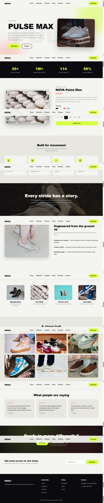

# Progree-NovaPlusMax

This repository contains a front-end e-commerce landing page clone, built as part of my one-month online Frontend Development Internship at **Progree**. The project — themed around a fictional sportswear brand "NOVA Pulse Max" — replicates a real-world product landing page using HTML, CSS, and JavaScript.

## Task
This project was completed as Task 2 of the Progree Frontend Development Internship, focused on building a fully responsive, multi-section landing page from a given design, strengthening skills in layout structuring, Flexbox/Grid, animations, and vanilla JavaScript interactivity.

## Features

* Sticky navbar with scroll-based background change and mobile hamburger menu
* Full-screen hero section with animated blobs and floating product image
* Animated stat counters (years, athletes, countries, satisfaction %)
* Product showcase with colorway swatches that dynamically swap the product photo
* Interactive size selector and "Add to Cart" feedback message
* Scroll-reveal animations (fade up / left / right / scale) using Intersection Observer
* Color collection grid and interactive image gallery
* Customer reviews section
* Working newsletter signup form with confirmation message
* Fully responsive design across devices

## Technologies Used

* HTML5
* CSS3 (Flexbox, Grid, custom animations, transitions)
* JavaScript (DOM manipulation, Intersection Observer API, event handling)

## Preview

## Author
Sehar Waseem 
Software Engineering Student
